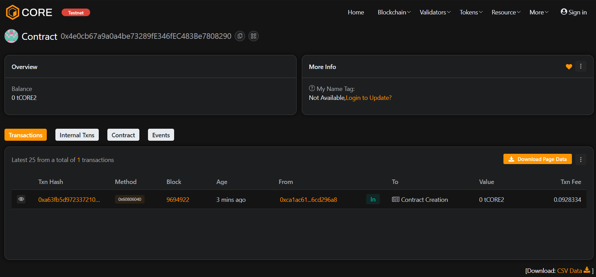

# EduToken: Blockchain-Based Student Rewards System

## Vision
EduToken aims to **reward learning and participation** on educational platforms using a decentralized, blockchain-based token system. Students earn tokens for completing assignments, quizzes, or contributing to discussions, and can redeem them for perks like certificates, course discounts, or NFT badges.

---

## Goals
- Create an **ERC-20 token (`EDU`)** to represent student rewards.
- Track and reward student achievements **automatically via smart contracts**.
- Issue **NFT badges** for milestone accomplishments (optional phase).
- Build a **frontend dashboard** for students to track and redeem tokens.
- Provide **admin functionality** to issue rewards and view student balances.

---

## Features

### Token System
- ERC-20 token (`EDU`) deployed on Ethereum testnets.
- Transferable between student accounts.
- Admin-controlled minting for rewards.

### Reward & Loyalty
- Smart contracts track student achievements.
- Automatic token issuance when students complete tasks.

### NFT Certificates (Optional)
- Students receive NFTs as badges for milestones.
- NFT metadata can be stored on IPFS.

### Web3 Frontend
- React-based dashboard with MetaMask integration.
- Students can view token balances and redeem rewards.
- Admin panel for issuing rewards and monitoring activity.

---

## Tech Stack
- **Blockchain:** Ethereum (Sepolia/Goerli Testnet)
- **Smart Contracts:** Solidity, Hardhat/Truffle
- **Frontend:** React.js, Web3.js / Ethers.js
- **Wallet Integration:** MetaMask
- **Storage for NFTs:** IPFS (optional)

---

## Roadmap

| Phase | Description |
|-------|-------------|
| Phase 1 | ERC-20 token contract & testnet deployment |
| Phase 2 | Reward minting logic for student achievements |
| Phase 3 | NFT milestone badges (optional) |
| Phase 4 | Web3 dashboard for students and admin |
| Phase 5 | Testing, bug fixes, and optimizations |

---

## Getting Started
1. Clone this repository.
2. Install dependencies: `npm install` or `yarn install`.
3. Deploy contracts on Sepolia/Goerli testnet using Hardhat/Truffle.
4. Connect frontend to deployed contracts with MetaMask.
5. Start earning EduTokens and testing reward features!

---
### Contract address:
0x4e0cb67a9a0a4be73289fE346fEC483Be7808290

## Licence
MIT Licence
